= SAÉ 2.03 -- Rapport
Léo Fantuz Chrobot <leo.fantuz-chrobot.etu@univ-lille.fr> | Mathéo Niel <matheo.niel.etu@univ-lille.fr> | Thomas Guislin <thomas.guislin.etu@univ-lille.fr>
v1.0, février {localyear}: Rapport de projet SAE 2.3
:description: Rapport sur notre projet réalisé lors de la SAE 2.3
:doctype: article
:encoding: utf-8
:lang: fr
:data-uri:
:toc: macro
:sectnums:
ifdef::backend-pdf[]
:pdf-theme: sae203
:pdf-fontsdir: fonts,GEM_FONTS_DIR
:pdf-page-margin: [15mm, 12mm]
:stylesheet: CSS/style.css
:pdf-stylesdir: YML/
:note-caption: Note

endif::[]

toc::[]

[abstract]
.Présentation du projet

Savoir installer correctement une machine (virtuelle ou non) ou un réseau peut savérer #nécessaire# lorsque l'on travaille dans le domaine de l'informatique. C'est pourquoi nous avons appris à installer convenablement une #machine virtuelle#, mais nous avons également eu l'occasion d'apprendre à mettre en place un #service réseau# interne lors de plusieurs semaines de travail.

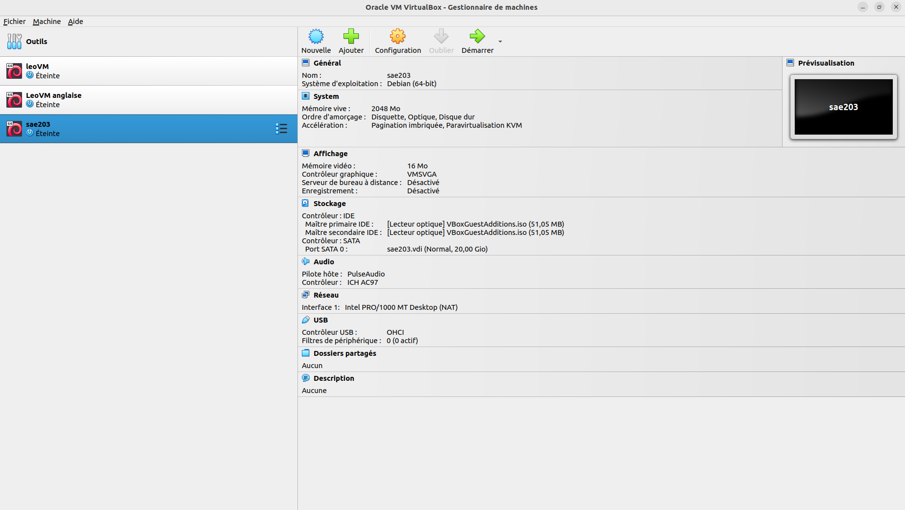

[[installation]]
== Installation d'une machine virtuelle automatique

[abstract]
.Création de la machine

[%header, cols="^.^h,.^3,^.^,^.^", stripes=hover]

Pour commencer, histoire de se remettre dans le bain, nous avons créé une machine virtuelle nommée #« sae203 »# de type #« Linux »#, possèdent ainsi une version #« Debian 64-bit »#, une **mémoire vive (RAM) de 2048 Mo** ainsi qu’un **disque dur de 20Go.**

Lors de la création de la machine, nous avons eu l'occasion de nous poser certaines questions, auxquelles nous avons trouvé réponse :

* **Que signifie “64-bit” dans “Debian 64-bit” ?**
** #« 64-bit »# dans #« Debian 64-bit »# signifie que la machine sera installée avec un processeur de 64 bits. Ainsi, un processeur 64 bits est un microprocesseur dans lequel la taille d'un mot machine est de 64 bits __(la machine peut ainsi traiter des données par paquets de 64 bits à la fois, ce qui permet une mémoire plus grande.)__. Une condition indispensable pour les applications fortement consommatrices de https://fr.wikipedia.org/wiki/Donn%C3%A9e[((données))] et de https://fr.wikipedia.org/wiki/M%C3%A9moire_(informatique)[((mémoire))] __(Comme les systèmes de gestion de https://fr.wikipedia.org/wiki/Base_de_donn%C3%A9es[((bases de données))] et les serveurs hauts performances)__.

* ** Quelle est la configuration réseau utilisé par défaut ? **
** La configuration réseau utilisé par défaut est la configuration réseau #« NAT »#. Ce mode d’accès au réseau permet aux machines virtuelles de communiquer à l’extérieur du réseau virtuel, à travers l’interface réseau de votre ordinateur physique hôte. Il s’agit là d’un autre Switch virtuel qui assure la connexion des machines virtuelles car https://fr.wikipedia.org/wiki/Adresse_IP[((l'adresse réseau IP))] est différente.

* ** Quel est le nom du fichier XML contenant la configuration de votre machine ? **
** Le nom du fichier https://fr.wikipedia.org/wiki/Extensible_Markup_Language[((XML))] contenant la configuration de la machine est #« sae203.vbox-prev »#. L’extension #« .vbox-prev »# ici signifie que le fichier est une sauvegarde de la configuration de la machine virtuelle. Chaque modification de la machine créée une copie portant cette extension, il suffit ainsi de remplacer #« .vbox-prev »# par #« .vbox »# pour utiliser cette sauvegarde en cas d’erreur sur la machine principale.

* ** Sauriez-vous le modifier directement ce fichier de configuration pour mettre 2 processeurs à
votre machine ? **
** Afin de mettre 2 processeurs à la machine, il faut se rendre dans le fichier XML dans la balise nommée #« CPU »# et y ajouter la ligne `<topology sockets="2" cores="2" threads="1"/>`. Ensuite, il faut redémarrer https://www.virtualbox.org/[((VirtualBox))] et la machine virtuelle, puis cela devraient fonctionner. Il est également possible de réaliser tout cela dans l’onglet #« Système »# des paramètres de la machine, puis cliquer sur #« processeur »# et enfin déterminer le nombre de processeurs souhaités.

Jusque-là, nous n'avons rencontré **aucune difficulté** concernant la mise en place de la machine avant installation. Il s'agit là d'une étape #déjà exercée# dans le passé lors d'un précédent projet.

[abstract]
.iso bootable

Nous avons ensuite attribué à la machine un #https://fr.wikipedia.org/wiki/Image_disque[((iso))] bootable# de https://www.debian.org/releases/index.fr.html[((Debian 12))] afin d’installer https://www.debian.org/releases/index.fr.html[((Debian))] sur la machine virtuelle. L’installation pouvait ainsi démarrer.

Nous avons décidé d’installer une machine nommée #« serveur »#, **sans domaine**, avec une **langue** réglée sur #« français »# comportant le **miroir** français « http://debian.polytech-lille.fr », **sans proxy**, avec un **compte administrateur** nommé #« root »# __(comportant un mot de passe #« root »#)__ et un **utilisateur** nommé #« User »# avec comme **mot de passe** #« user »#. pour finir, notre **disque** comporte une **seule partition**, et nous avons également ajouté quelque **logiciels de démarrage** utiles tels que l’environnement de bureau https://www.debian.org/releases/index.fr.html[((Debian))], **https://wiki.debian.org/fr/MATE[((MATE))]** __(sans https://wiki.debian.org/fr/Gnome[((Gnome))])__, un **https://fr.wikipedia.org/wiki/Serveur_web[((serveur web))]** et **https://doc.ubuntu-fr.org/ssh[((ssh))]** ainsi que **l’utilitaire usuels du système**.

Suite à cela, plusieurs interrogations nous sont venues en tête :

. **Qu’est-ce qu’un fichier iso bootable ?**
.. Un fichier #https://fr.wikipedia.org/wiki/Image_disque[((iso))] bootable# est un fichier image créé à partir d’un #CD# ou d’un #DVD#. Ainsi, une #clé USB# peut être transformée afin d’imiter le comportement d’un #CD# ou d’un #DVD#. Ainsi, en y instaurant uniquement #l’https://fr.wikipedia.org/wiki/Image_disque[((iso))] du système d’exploitation# souhaité, il est possible d’installer ce dernier sur la machine. __(Source : https://www.lesnumeriques.com/telecharger/iso-to-usb-20012)__.

. **Qu’est-ce que MATE ? GNOME ?**
.. https://wiki.debian.org/fr/MATE[((MATE))] est un https://fr.wikipedia.org/wiki/Fork_(d%C3%A9veloppement_logiciel)[((Fork))] de https://wiki.debian.org/fr/Gnome[((Gnome))] __(c’est-à-dire un logiciel créé à partir du **code source** de https://wiki.debian.org/fr/Gnome[((Gnome))])__. Il s’agit là d’un **environnement de bureau libre** utilisant une **boîte à outils** #« GTK+ 3.x »# et destiné aux **systèmes d’exploitation** apparentés à **UNIX**. __(source : https://fr.wikipedia.org/wiki/MATE)__.
.. https://wiki.debian.org/fr/Gnome[((Gnome))] quant à lui est également un **environnement de bureau libre** dont l’objectif est de rendre accessible l’utilisation du **système d’exploitation #GNU#** au plus grand nombre. __(Source : https://fr.wikipedia.org/wiki/GNOME)__.

. **Qu’est-ce qu’un serveur web ?**
.. Un https://fr.wikipedia.org/wiki/Serveur_web[((serveur web))] peut soit être un **logiciel de service de ressources web** __(#serveur HTTP#)__, soit un **serveur informatique** __(ordinateur)__ qui répond à des **requêtes du World Wide Web** sur un **réseau public** __(#Internet#)__ ou privé __(#intranet#)__, en utilisant principalement le **protocole HTTP**. __(Source : https://fr.wikipedia.org/wiki/Serveur_web)__.

. **Qu’est-ce qu’un serveur ssh ?**
.. https://doc.ubuntu-fr.org/ssh[((ssh))] est un #« shell »# __(Un #« terminal »#, permettant la **gestion des serveurs Linux** via la possibilité de **dialoguer** avec une **machine** ou un **serveur** via l’exécution de différentes **commandes** qui retourneront des informations)__ ou **protocole réseau** qui permet aux administrateurs d'accéder à distance à un ordinateur, en toute sécurité. __(Source : https://www.it-connect.fr/chapitres/quest-ce-que-ssh/)
(Source 2 : https://www.cloudflare.com/fr-fr/learning/access-management/what-is-ssh/)__.

. **Qu’est-ce qu’un serveur mandataire ?**
.. Un https://www.techno-science.net/definition/3812.html[((serveur mandataire))] (souvent appelé aussi #« https://fr.wikipedia.org/wiki/Proxy[((proxy))] »#) est un https://fr.wikipedia.org/wiki/Serveur_informatique[((serveur informatique))] qui a pour fonction de relayer des **requêtes** entre un **poste client** et un **serveur**. Les https://www.techno-science.net/definition/3812.html[((serveurs mandataires))] sont notamment utilisés pour assurer les fonctions suivantes :
... Mémoire cache ;
... La journalisation des requêtes (" logging ") ;     
... La sécurité du réseau local ;     
... Le filtrage et l'anonymat. 

[abstract]
.Attribution droits sudo

Nous avons par la suite attribuer le groupe #« sudo »# à l’utilisateur #« user »# via la commande suivante :

====
`sudo adduser user sudo`
====

NOTE: Pour savoir à quels groupes appartient l’utilisateur #« user »#, il faut écrire la commande `groups user` dans le terminal de commande.

De même que pour les étapes précédentes, aucune difficulté n'a été rencontrer, car nous connaissions déjà le processus grâce à l'un de nos projets passé.

[abstract]
.Installation des suppléments invités

Ensuite, il a fallu installer des https://www.linuxtricks.fr/wiki/installer-les-additions-invite-virtualbox-dans-debian[((suppléments invités))]. Pour cela, nous pouvons **cliquer** sur #« Périphériques »# en haut de l’écran de la machine virtuelle lancée, puis #« Insérer l’image CD des Additions invité... »#, puis **monter le CD** à l’aide de la **commande** `sudo mount /dev/cdrom/mnt`  puis `sudo /mnt/VboxLinuxAdditions.run` __(ou faire un `cd /media/cdrom0` puis `sudo sh VboxLinuxAdditions.run`)__. Cela permet par exemple d’avoir une page dimensionnée aux bonnes dimensions.

À partir de cette étape, il s'agit d'une situation #nouvelle# à laquelle nous n'avons jamais dû faire face. Nous avons ainsi dû nous renseigner __(notamment sur Internet)__ sur ce qu'étaient les suppléments invités ainsi que la manière de les installer et leurs spécificités, suite à quoi nous avons pu nous poser les questions suivantes :

* **Quel est la version du noyau Linux utilisé par votre VM ?**
** Afin de connaître la **version** du https://fr.wikipedia.org/wiki/Noyau_Linux[((noyau Linux))] utilisé par notre machine, nous pouvons entrer la commande `sudo uname -r`. Dans notre cas, cela nous renvois #« 6.1.0-17-amd64 »#. Cela signifie que notre https://fr.wikipedia.org/wiki/Noyau_Linux[((noyau Linux))]  utilise la version #« 6.1.0-17 »# d’https://fr.wikipedia.org/wiki/AMD64[((adm64))] (https://fr.wikipedia.org/wiki/AMD64[((ADM64))] étant le nom de l’architecture des premiers **microprocesseurs 64 bits** de la société #« Advanced Micro Devices »#). __(Source : https://fr.wikipedia.org/wiki/AMD64)__.

* **À quoi servent les suppléments invités ?**
** Les https://www.linuxtricks.fr/wiki/installer-les-additions-invite-virtualbox-dans-debian[((additions invitées))] sont une **collection** de **pilotes** de **périphériques** et d’**applications système** pour https://www.virtualbox.org/[((VirtualBox))] qui améliorent les performances du système d’exploitation invité et permettent une meilleure interaction entre la machine hôte et la machine invitée. Cela permet par exemple d’y intégrer le **pointeur de la souris**, les **dossiers partagés**, de **meilleures performances graphiques**, la *synchronisation** de l’**heure** entre l’hôte et l’invité et bien plus encore. __(Source : https://lecrabeinfo.net/virtualbox-installer-les-additions-invite-guest-additions.html)__.

* **À quoi sert la commande mount (dans notre cas de figure et dans le cas général) ?**
** Dans le cas général, la commande `mount` permet de demander au **système d’exploitation** de rendre un https://fr.wikipedia.org/wiki/Syst%C3%A8me_de_fichiers[((système de fichiers))] **accessible**, à un emplacement spécifié. Ainsi, elle nous permet de monter un https://fr.wikipedia.org/wiki/Syst%C3%A8me_de_fichiers[((système de fichiers))] indiqué comme répertoire à l’aide du paramètre #« Noeud:Répertoire »#, sur le répertoire spécifié par le paramètre Répertoire.
Dans notre cas, cela nous a permis de rendre le fichier #« cdrom »# accessible afin de pouvoir exécuter le fichier #« VBoxLinuxAdditions.run »#.

* **Qu’est-ce que le Projet Debian ? D’où vient le nom Debian ?**
** Le projet https://www.debian.org/releases/index.fr.html[((Debian))] est un groupe de personnes **volontaires** d’envergure mondiale qui s’efforcent de produire un https://fr.wikipedia.org/wiki/Syst%C3%A8me_d%27exploitation[((système d'exploitation))] qui soit composé exclusivement de **logiciels libres**. Ce projet a pour principal produit la distribution #Debian GNU/Linux#, qui inclut le https://fr.wikipedia.org/wiki/Noyau_Linux[((noyau Linux))] ainsi que des milliers d’applications pré empaquetées. Le nom vient des prénoms du créateur de Debian __(Ian Murdock)__ et son épouse __(Debra)__. __(https://www.debian.org/doc/manuals/project-history/intro.fr.html)__.

* **Il existe 3 durées de prise en charge (support) de ces versions : la durée minimale, la durée en support long terme (LTS) et la durée en support long terme étendue (ELTS). Quelle sont les
durées de ces prises en charge ?**
** La durée minimale des prises en charge des versions de https://www.debian.org/releases/index.fr.html[((Debian))] est :
*** Minimale : 2 ans.
*** Durée en support long terme (LTS) : minimum 5 ans. (pour une prise en charge à long terme)
*** Durée en support long terme étendue (ELTS) : minimum 1 an. __(https://www.debian-fr.org/t/debian-lts-quelle-duree-de-prise-en-charge-a-long-terme/80566/3)__.

* **Pendant combien de temps les mises à jour de sécurité seront-elles fournies ?**
** Tous les deux mois, les responsables de la version **stable** vérifient la liste des **paquets** de #« proposed-updates »# et décident si un paquet est approprié ou non pour stable. Ces modifications sont **rassemblées** dans une **nouvelle version** __(révision)__ de #« stable »# __(par exemple #"2.2r3"# ou #"2.2r4"#)__. __(https://www.debian.org/security/faq.fr.html)__.

* **Combien de version au minimum sont activement maintenues par Debian ?**
** Debian a toujours au moins **trois versions** activement entretenues : la version #« stable »# qui contient la **dernière distribution** officiellement sortie de https://www.debian.org/releases/index.fr.html[((Debian))], la version #« testing »# qui contient les **paquets** qui n’ont pas encore été acceptés dans la distribution #« stable »# mais qui sont en attente de l’être, et la version #« unstable »# dont les **activités de développement** se **déroulent**. Généralement, cette distribution est utilisée par les développeurs et par ceux qui aiment **vivre sur le fil**. __(https://www.debian.org/releases/index.fr.html)__.

* **Chaque distribution majeur possède un nom de code différent. Par exemple, la version majeur
actuelle (Debian 12) se nomme bookworm. D’où viennent les noms de code données aux
distributions ?**
** Quand une distribution https://www.debian.org/releases/index.fr.html[((Debian))] est en cours de développement, elle n’a **aucun numéro de version**, mais un **nom de code**. Le but de ces noms de code est de faciliter la **copie sur les miroirs** des distributions https://www.debian.org/releases/index.fr.html[((Debian))] __(si un véritable répertoire comme #« unstable »# est soudainement renommé en #stable#, beaucoup de choses devraient être inutilement téléchargées)__. Jusqu’ici, les noms de code proviennent des personnages des films #« Toy Story »# par **Pixar** __(ex : buzz, rex, bo, hamm, jessie, etc...)__. __(https://www.debian.org/doc/manuals/debian-faq/ftparchives.fr.html)__.

* **L’un des atouts de Debian fut le nombre d’architecture (≈ processeurs) officiellement prises en charge. Combien et lesquelles sont prises en charge par la version Bullseye ?**
** Il y a **9 architectures** gérées par la version #« Bullseye »# :
*** PC 64 bits (amd64)
*** ARM 64 bits (AArch64)     
*** EABI ARM (armel)     
*** ARM avec unité de calcul flottant (armhf)     
*** PC 32 bits (i386)     
*** MIPS (petit-boutiste)     
*** MIPS 64 bits (petit-boutiste)     
*** PowerPC 64 bits (petit-boutiste)     
*** System z __(https://www.debian.org/releases/bullseye/index.fr.html)__.

* **Quelle a était le premier nom de code utilisé ? Quand a-t-il été annoncé ? Quelle était le numéro de version de cette distribution ?**
** Le **premier nom de code** utilisé par https://www.debian.org/releases/index.fr.html[((Debian))] est #« Buzz »# __(il s’agit là de la version Debian 1.1)__. __(https://www.debian.org/distrib/archive)__.
** Cette **première version** fut annoncée et publiée le **17 juin 1996** sous le nom de #Debian GNU/Linux 1.1#. __(https://wiki.debian.org/fr/DebianBuzz)__.
** Comme cité précédemment, le **numéro de version** de la distribution #« Buzz »# est #« Debian 1.1 »#. __(https://wiki.debian.org/fr/DebianBuzz)__.

* **Quel est le dernier nom de code annoncée à ce jour ? Quand a-t-il été annoncé ? Quelle est la version de cette distribution ?**
** Actuellement, le **dernier nom de code** annoncé à ce jour est #« Bookworm »". __(https://www.debian.org/releases/index.fr.html)__.
** La **version initiale** fut publiée le **10 juin 2023**, mais la **dernière en date** fut publiée le **10 février 2024**. __(https://www.debian.org/releases/bookworm/)__.
** La **version** de cette distribution est #« Debian 12.0 »# __(pour la première)__, et #« Debian 12.4 »# __(pour la dernière en date)_. __(https://www.debian.org/releases/bookworm/)__.

[abstract]
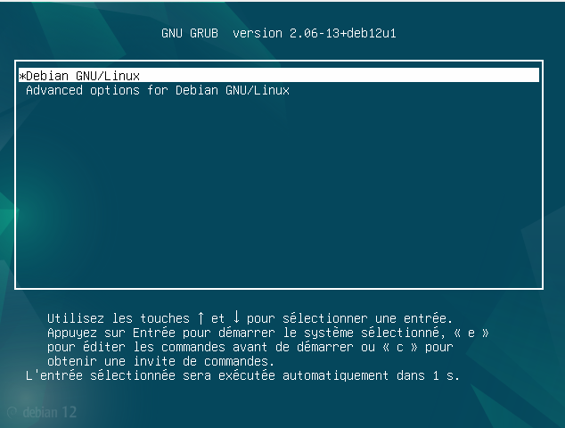

====
Concernant cette étape, la seule problématique rencontrée et le processus d'installation qui peut s'avérer très long et répétitif. C'est pourquoi dans la prochaine étape, nous verrons comment nous avons réussi à installer de manière automatique notre machine virtuelle à l'aide d'une pré-configuration.
====

[abstract]
.Pré-configuration de la machine virtuelle

Pour finir, pour utiliser une **pré-configuration** afin de **configurer automatiquement** notre machine virtuelle, nous avons entré la commande suivant dans le terminal à l’emplacement exact de notre machine virtuelle :

====
`sed -i -E ‘‘s/(--iprt-iso-maker-file-marker-bourne-sh).*$/\1=$(cat /proc/sys/kernel/random/uuid)/’’ S203-Debian12.viso` footnote:[Dans cette commande, #"s02-Debian12.viso"# est a modifier par le nom du #".viso"# que l'on souhaite utilisé]
====

Nous avons ensuite **inséré le fichier** #« S203_Debian12.viso »# dans le lecteur optique __(cd/dvd)__ de notre machine virtuelle, puis nous avons **démarré la machine virtuelle** et **laissé faire l’installation** se dérouler jusqu’au reboot. Pour finir, nous avons changé la pré-configuration en **ajoutant les paquets**  #MATE, sudo, git, sqlite3, curl, bash-completion et neofetch# ainsi que les **droits sudo** à l’utilisateur #user#.

NOTE: Pour installer les **paquets** #MATE, sudo, git, sqlite3, curl, bash-completion et neofetch#, il faut entrer la commande `d-i pkgsel/include string mate-desktop-environment-core sudo git sqlite3 curl bash-completion neofetch` dans la catégorie #« Packages, Mirrors, Image »# du **fichier de préconfiguration** #« preseed.cfg »#. Pour **attribuer les droits sudo** à l’utilisateur **user**, il suffit d’ajouter la ligne de commande `d-i usermod -aG sudo user` dans la catégorie #« Ajout des comptes root et user »#.

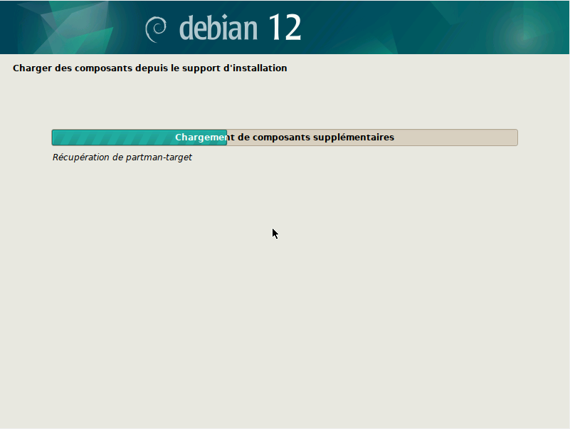

====
Cette installation nous a posé beaucoup de problèmes dû au #temps d'installation# extrêmement **long** __(parfois plus d'une *dizaine** de minutes)__ ainsi que les difficultés rencontrées lors de la mise en place de l'installation automatique des paquets #sudo, git, sqlite3, curl, bash-completion, neofetch et surtout MATE#. Pour remédier à cela, nous avons #rechercher# sur de nombreux sites la solution à ces problèmes, suite à quoi nous avons réussi à les résoudre à l'aide des étapes citées précédemments.
====

<<<

[[ballisage]]
== Apprentissage balisage de base

[abstract]
.Recherches

Dans un second temps, nous avons fait des recherches poussées de nous former à l'écriture d'un rapport grâce à https://fr.wikipedia.org/wiki/Markdown[((Markdown))] / https://pandoc.org/[((Pandoc))] ou https://fr.wikipedia.org/wiki/AsciiDoc[((AsciiDoctor))] __(systèmes de balisages permettant la simplification d'écriture d'un rapport)__. Ainsi, voici les différentes balises possibles :

|====
^.^| **Balises** ^.^| **Markdown** ^.^| **Asciidoctor** ^.^
| Italique ^.^| \_texte en italique_ ^.^| \\__texte en italique__ ^.^
| Gras ^.^| \\**texte en gras** ^.^| \\**texte en gras**
| Texte barré ^.^| ~~texte barré~~ ^.^|  ^.^
| Titre ^.^| # Titre (plus il y'a de "#", plus le titre est petit) ^.^| = Titre (plus il y'a de "=", plus le titre est petit)
| Paragraphe ^.^| #saut de ligne# ^.^| #saut de ligne# ^.^
| Citation ^.^| >Citation ^.^| 
| Commentaire ^.^| <!-- Commentaire --> ^.^| // Commentaire ^.^
| Liste simple ^.^| - Liste ^.^| * Liste ^.^
| Sous liste simple ^.^| ^.^| ** Liste ^.^
| Liste numérotée ^.^| 1. Liste ^.^| 1. Liste ^.^
| Liste à cocher ^.^| [ ] A ou [X] B ^.^| [ ] A ou [x] B ^.^
| Code ^.^| \`code` ^.^| \`code` ^.^
| Hyperliens ^.^| [Lien](https://example.com/ "titre de lien optionnel") ^.^| Lien[\((titre de lien optionnel))] ^.^
| Image ^.^|  ^.^| image::image.png[Titre] ^.^
| Tableau ^.^| \|cellule 1\|cellule 2\| ^.^| \|=== \| cellule1 \| cellule2 \|=== ^.^
| Commentaire ^.^| <!-- Commentaire --> ^.^| // Commentaire ^.^
| Note de bas de page ^.^ | [^1]: Vous trouverez ici le texte de la note de bas de page ^.^ | 
| Annuler utilisation d'une balise __(exemple avec la balise #gras#)__ ^.^ | \\*exemple avec des astérisques\* ^.^ | \\*exemple avec des astérisques* ^.^

|====

[abstract]
.Installations

Afin d'installer #Pandoc#, il faut écrire les commandes suivante dans le terminal de commande :

====
`sudo apt update`

`sudo apt install pandoc`
====

Afin d'installer #Asciidoctor#, il faut écrire les commandes suivante dans le terminal de commande :

====
`sudo apt update`

`sudo apt install ruby-full`

`sudo gem install asciidoctor`
====

Afin d'installer #Asciidoctor-pdf#, il faut écrire les commandes suivante dans le terminal de commande :

====
`sudo apt update`

`sudo apt install ruby-full`

`sudo gem install asciidoctor-pdf`
====

[abstract]
.Utilisations

Pour **transformer** un format #« Markdown »# en #« html »#, il faut entrer la commande suivant dans le terminal de commande:

====
`pandoc -o nom_fichier.html nom_fichier`
====

Pour **transformer** un format #« adoc »# en #« html »#, il faut entrer la commande suivant dans le terminal de commande:

====
`asciidoctor nom_fichier.adoc`
====

Pour **transformer** un format #« adoc »# en #« pdf »#, il faut entrer la commande suivant dans le terminal de commande:

====
`asciidoctor-pdf nom_fichier.adoc`
====

NOTE: Afin de rédiger un rapport en https://fr.wikipedia.org/wiki/Markdown[((Markdown))] ou https://fr.wikipedia.org/wiki/AsciiDoc[((AsciiDoctor))], il est possible d'utiliser n'importe quel éditeur de texte.

[IMPORTANT]
Ne pas oublier d'ajouter l'extension #".adoc"# au fichier contenant le code https://fr.wikipedia.org/wiki/AsciiDoc[((AsciiDoctor))].

====
L'apprentissage du #balisage léger# n'est pas une étape compliquée en soi. Le plus compliquer est surtout la **manière** de l'utiliser. Un grand nombre de nos difficultés fut dans la **mise en place** de notre rapport à l'aide des différents types de balisage disponible par https://fr.wikipedia.org/wiki/AsciiDoc[((AsciiDoctor))]. Cependant, une fois la prise en main effectuée __(bien que cela nous est pris quelques heures)__, il est vrai que l'utilisation nous est déformé plus **simple**, nous permettant ainsi de rédiger ce rapport de manière simple et naturelle.
====

[[Git]]
== Utilisation de Git

[abstract]
.Présentation de Git

Parmi les nombreux outils disponibles permettant de travailler de manière **efficace** en **équipe** (notamment dans le domaine du **développement informatique** dans notre cas, mais pas seulement), nous retrouvons notamment le logiciel https://fr.wikipedia.org/wiki/Git[((Git))].

https://fr.wikipedia.org/wiki/Git[((Git))] est un **logiciel de gestion de versions décentralisé**. Il s'agit là d'un logiciel #libre# et #gratuit# créé en 2005 par #https://fr.wikipedia.org/wiki/Linus_Torvalds[((Linus Torvalds))]#, auteur du **noyaux Linux**.

Voici les nombreuses options disponibles avec https://fr.wikipedia.org/wiki/Git[((Git))]:

|====
^.^| **Commande** | **Déscription** 
| `git init` | crée un nouveau dépôt 
| `git clone`| clone un dépôt 
| `git add`| ajoute de nouveaux objets blobs dans la base des objets pour chaque fichier modifié depuis le dernier commit. Les objets précédents restent inchangés 
| `git commit` | intègre la somme de contrôle https://fr.wikipedia.org/wiki/SHA-1[((SHA-1))] d'un objet __tree__ et les sommes de contrôle des objets __commits__ parents pour créer un nouvelle objet __commit__ 
| `git branch`| pour la gestion des branches 
| `git merge` | fusionne une branche dans une autre 
| `git rebase` | déplace les commits de la branche courante devant les nouveaux commits d'une autre branche 
| `git log` | affiche la liste des commits effectués sur une branche 
| `git push` | publie les nouvelles révisions sur le __remote__ (La commande prend différents paramètres) 
| `git pull` | récupère les dernières modifications distantes du projet (depuis le __Remote__) et les fusionne dans la branche courante 
| `git stash` | stocke de côté un état non commité afin d'effectuer d'autres tâches 
| `git checkout` | annule les modifications effectuées, déplacement sur une autre référence (branche, hash) 
| `git switch` | changement de branche 
| `git revert` | défait les modifications d'un commit précédent 
| `git remote` | gestion des __remotes__ 

|====

[abstract]
.Configuration de Git

Ainsi, après avoir installer https://fr.wikipedia.org/wiki/Git[((Git))] à l'aide de la commande `sudo apt install git`, nous l'avons configuré (afin de pouvoir l'utiliser convenablement) à l'aide des commandes suivantes:

====
`git config --global user.name "Prénom Nom"`
====

NOTE: Cette commande définit dans les options globales le nom de l’utilisateur.
#"Prénom Nom"# est à remplacer par le nom d'utilisateur souhaité.

====
`git config --global user.mail "adresse mail"`
====

NOTE: Cette commande définit dans les options globales l’adresse mail de l’utilisateur.
#"adresse mail"# est à remplacer par l'adresse mail souhaité.

====
`git config --global init.defaultBranch « master »`
====

NOTE: Cette commande définit dans les options globales permet d’éviter le warning concernant la création d’une branche par défaut.

[abstract]
.Installation de Gitk

Par la suite, nous avons installé https://www.atlassian.com/fr/git/tutorials/gitk[((Gitk))]  grâce à la commande `sudo apt install gitk`.

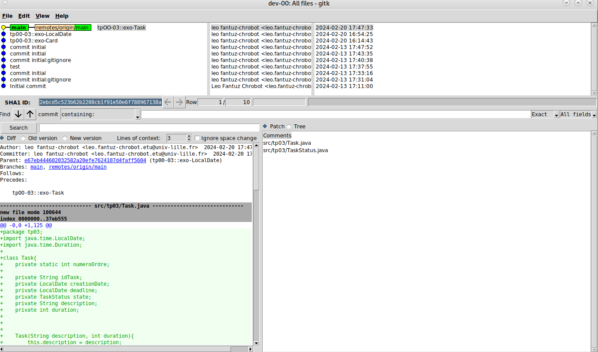

NOTE: https://www.atlassian.com/fr/git/tutorials/gitk[((Gitk))] est un **navigateur de dépôt graphique**, le #premier# de son genre. Il peut être considéré comme un **encapsuleur graphique** pour git log. Il permet notamment #d'explorer# et de #visualiser# l'historique d'un dépôt. Pour le lancer, il suffit de noter la commande suivante dans le terminal de commande, à l'emplacement du répertoire Git: `gitk`.

[abstract]
.Installation de Git-Gui

Puis, nous avons également installé https://www.google.com/url?sa=t&rct=j&q=&esrc=s&source=web&cd=&ved=2ahUKEwji7afOg7-EAxWpRaQEHZXODCkQFnoECBAQAQ&url=https%3A%2F%2Fcodeur-pro.fr%2Fgit-gui-guide-complet%2F&usg=AOvVaw07GAOI2iY3GQK3HMsMwleh&opi=89978449[((git-gui))] à l’aide de la commande `sudo apt install git-gui`.

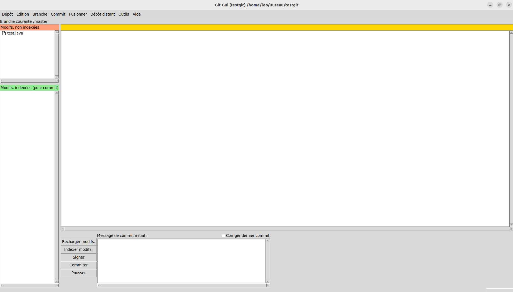

NOTE: https://www.google.com/url?sa=t&rct=j&q=&esrc=s&source=web&cd=&ved=2ahUKEwji7afOg7-EAxWpRaQEHZXODCkQFnoECBAQAQ&url=https%3A%2F%2Fcodeur-pro.fr%2Fgit-gui-guide-complet%2F&usg=AOvVaw07GAOI2iY3GQK3HMsMwleh&opi=89978449[((git-gui))] est #un des outils de bases# fourni avec **Git** lors de son installation. **Git Gui** est une **interface graphique** permet de #voir la différence# des modifications en cours dans notre espace de travail ou encore de #faire des commits# et des #pushs# __(et bien plus encore)__. En terme de #fonctionnalité#, **Git Gui** est très similaire à https://www.atlassian.com/fr/git/tutorials/gitk[((Gitk))]. Pour le lancer, il suffit de noter la commande suivante dans le terminal de commande, à l'emplacement du répertoire Git: `git gui` footnote:[Selon les sources trouvées sur internet, la commande indiquée afin de lancer git gui peut parfois être `git-gui`, cependant, il se pourrait bien que cette commande ne fonctionne pas toujours.].

[abstract]
.Installation de GitFiend

Finalement, nous avons installé une **interface graphique** nommé https://gitfiend.com/[((GitFiend))]. Il s'agit là d'une interface graphique #libre# et #gratuite# que nous avons trouvé via le site http://git-scm.com/download/gui/linux[((git-scm.com))], permettant la **gestion d’un projet Git**.

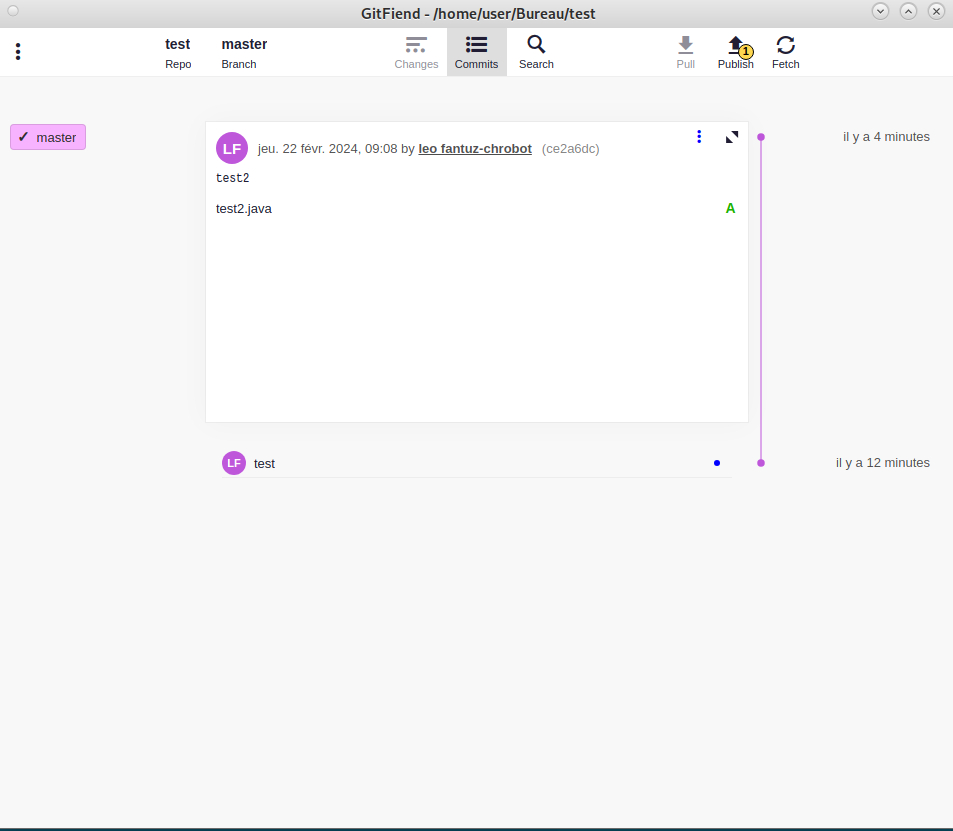

Ce logiciel est #facilement utilisable# par son **interface** bien **organisée** et très **intuitive**. De plus, la possibilité de #créer# et #ouvrir# un **dépôt** directement via l’interface permet un usage plus #simple# de **Git**.

Grâce au site cité précédemment, nous avons pu #installer# un fichier #".deb"# (https://fr.wikipedia.org/wiki/Deb[((deb))] étant le format de fichier des **paquets logiciels** de la distribution https://fr.wikipedia.org/wiki/Debian[((Debian GNU/Linux))]) permettant l’installation via la ligne de commande suivante :

====
`su -`

`sudo apt-get install /home/user/Bureau/GitFiend_0.44.3_amd64.deb`
====

NOTE: Nous avons #déplacé# le fichier dans le **Bureau** de l’utilisateur **user**. Le #".deb"# représente la #dernière version# de **GitFiend**. Il est aussi bon de spécifier que le fichier #".deb"# peut également être #téléchargé# via le site officiel de https://gitfiend.com/[((GitFiend))].

====

Si l’on compare https://gitfiend.com/[((GitFiend))] avec https://www.atlassian.com/fr/git/tutorials/gitk[((Gitk))] et https://www.google.com/url?sa=t&rct=j&q=&esrc=s&source=web&cd=&ved=2ahUKEwji7afOg7-EAxWpRaQEHZXODCkQFnoECBAQAQ&url=https%3A%2F%2Fcodeur-pro.fr%2Fgit-gui-guide-complet%2F&usg=AOvVaw07GAOI2iY3GQK3HMsMwleh&opi=89978449[((git-gui))], nous pouvons remarquer que toutes ces interfaces permettent de #créer# de nouveaux fichiers et de #faire des commits, push et pull#. Cependant, l’utilisation de https://gitfiend.com/[((GitFiend))] est plus **intuitive**, ce qui peut grandement **faciliter** la gestion d'un projet Git car l'interface peut paraître plus #"moderne"# pour certains. Néanmoins, il est vrai que #l’ajout de nouvelles options# n’est pas possible via l’interface https://gitfiend.com/[((GitFiend))]. Ce manque de possibilité d'ajout d'option peut parfois rendre le logiciel #obsolète# lorsque les fonctionnalités souhaitées deviennent #précises# et #spécifiques#.
====

====
Cette étape nous a posé problème lors de la **recherche d'un logiciel** autre que #gitk# et #git-gui# __(nous ayant ainsi amenées à l'installation de #GitFiend#)__ car bon nombre de logiciels d'interface #git# ne sont pas totalement **gratuit** et **libre**. Cependant, après quelque recherche, nous avons réussi à trouver GitFiend, que nous avons testé et rapidement réussi à prendre en main par son utilisation **simple** et **intuitive**. Il s'agit là d'un logiciel que nous pourrions évidemment réutiliser lors de nos prochains projets afin de simplifier la gestion de ces derniers.
====

[[Gitea]]
== Installation de Gitea

[abstract]
.Mise en place redirection des ports

Par la suite, nous nous sommes intéressé à #gitea# et ses #spécificités#. Ainsi, nous avons commencé par réaliser la **redirection** du **port 3000** de notre machine hôte vers le **port 3000** de notre machine virtuelle en se rendant dans les paramètres de notre machine virtuelle, puis dans la catégorie #« Réseau »#, puis nous avons cliquer sur le bouton situé en bas de la page intitulé #« Redirection de ports »#, suite à quoi nous avons créé une nouvelle redirection comportant les __caractéristiques__ présents sur l’image ci-dessous :

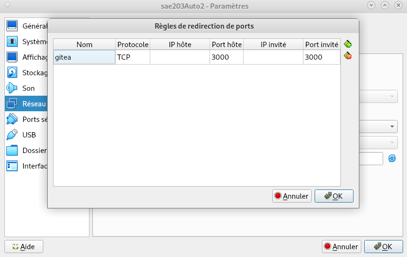

[abstract]
.Présentation de Gitea

Avant de commencer à installer https://fr.wikipedia.org/wiki/Gitea[((Gitea))], nous pouvons nous demander qu’est ce que https://fr.wikipedia.org/wiki/Gitea[((Gitea))] ?
Eh bien https://fr.wikipedia.org/wiki/Gitea[((Gitea))] est une #forge logicielle# libre en #Go# sous la licence #MIT# permettant **l’hébergement de développement logiciel**, basé sur le logiciel de gestion de versions **Git** concernant la gestion du `code source`, comportant ainsi un système de suivi des bugs, un wiki, ainsi que des outils pour la relecture du code. https://fr.wikipedia.org/wiki/Gitea[((Gitea))] est également disponible __24 heures sur 24__, totalement __libre__ et __gratuit__ et permet également #l’import et l’export de données# ainsi que la #gestion des médias# et bien plus encore.

Ce logiciel peut notamment être comparé à d’autres logiciels bien connus dans ce domaine, comme **GitLab** (offrant ainsi une #gestion du référentiel git#, les #révisions de code# et bien plus encore), ou bien même **GitHub** (étant ainsi le meilleur endroit pour #partager du code# avec des amis, des collègues, des camarades de classe ou bien même de parfait inconnus). Nous pouvons également retrouver des logiciels un peu moins connus tels que **Gogs**, **Phabricator** ou bien même **Bitbucket**. 

Ainsi, nous avons commencer l’installation de https://fr.wikipedia.org/wiki/Gitea[((Gitea))] sur notre machine virutelle :

[abstract]
.1ère étape

Pour installer https://fr.wikipedia.org/wiki/Gitea[((Gitea))], nous somme passer par https://doc.ubuntu-fr.org/wget[((Wget))] (programme en ligne de commande non interactif de téléchargement de fichiers depuis le Web), à l’aide des commandes suivantes :

====
`wget -O gitea https://dl.gitea.com/gitea/1.21.7/gitea-1.21.7-linux-amd64`

`chmod +x gitea`
====

NOTE: (si wget n’est pas installé, il faut l’installer avant d’exécuter les commandes précédentes à l’aide de la commande `sudo apt install wget`).

Ensuite, nous avons vérifier les #signature GPS# à l’aide des commandes suivantes :

====
`gpg --keyserver keys.openpgp.org --recv 7C9E68152594688862D62AF62D9AE806EC1592E2`

`gpg --verify gitea-1.21.7-linux-amd64.asc gitea-1.21.7-linux-amd64`
====

NOTE: (dans cette dernière commande, #gitea-1.21.7-linux-amd64.asc# est à remplacer par le **.asc** souhaité et #gitea-1.21.7-linux-amd64# est à remplacer par la **version de gitea** souhaité, ici, il s’agit des fichier installés par nos soins).

Nous avons ensuite vérifié que Git était installé sur notre machine à l’aide de la commande `git --version`.

Puis nous avons crée un utilisateur afin de lancer **Gitea** sur ce dernier à l’aide de la commande suivant :

====
`adduser \
   --system \
   --shell /bin/bash \
   --gecos 'Git Version Control' \
   --group \
   --disabled-password \
   --home /home/git \
   git`
====

Par la suite, la création d’une #structure de dossiers# fût nécessaire afin d’installer **Gitea** à l’aide des commandes suivantes :

====
`mkdir -p /var/lib/gitea/{custom,data,log}
chown -R git:git /var/lib/gitea/
chmod -R 750 /var/lib/gitea/
mkdir /etc/gitea
chown root:git /etc/gitea
chmod 770 /etc/gitea`
====

Ensuite, nous avons #configuré# le dossier **Gitea** à l’aide de la commande `export GITEA_WORK_DIR=/var/lib/gitea/`, puis nous avons #copier# le binaire **Gitea** vers une __localitation globale__ à l'aide de la commande `cp gitea /usr/local/bin/gitea`.

[abstract]
.2ème étape

afin de lancer **Gitea**, nous avons procédé ainsi :

Pour commencer, nous avons #crée# un fichier #« gitea.service »# dans le répertoire #« /etc/systemd/system/gitea.service »#, puis nous y avons #copié# quelques lignes nécessaire à son bon fonctionnement que nous ne mentionnerons pas ici car #beaucoup trop de lignes#.

Ensuite, nous avons #activé et lancé# **Gitea** en tant que boot avec les commandes suivantes :

====
`sudo systemctl enable gitea`

`sudo systemctl start gitea`
====

NOTE: Il est également possible #d’activer# et #d’activer# et de #lancer# **Gitea** à l’aide de la commande suivante dans le cas où notre **systemd** se trouve en #version 220# ou plus :

====
`sudo systemctl enable gitea --now`
====

Par la suite, nous avons installer **supervisor** à l’aide de la commande suivante :

====
`sudo apt install supervisor`
====

NOTE: (Il s’agit là d’un #système client/serveur# qui permet à ses utilisateurs de #surveiller# et de #contrôler# un certain nombre de **processus** sur des **systèmes d’exploitation** de type **UNIX**).

La création d’un #fichier supervisor# fut ainsi nécessaire à l’utilisation de **supervisor**. Cela à été réalisé par nos soins à l’aide de la commande suivante :

====
`mkdir /home/git/gitea/log/supervisor`
====

NOTE: (Cette commande s’exécute en supposant que **Gitea** est installé dans le fichier #« /home/git/gitea »#).

L’une des dernières étapes fut de #configurer# notre **supervisor** en inscrivant dans le fichier #« /etc/supervisor/supervisord.conf »# les lignes suivantes :

====
[program:gitea]
directory=/home/git/go/src/github.com/go-gitea/gitea/
command=/home/git/go/src/github.com/go-gitea/gitea/gitea web
autostart=true
autorestart=true
startsecs=10
stdout_logfile=/var/log/gitea/stdout.log
stdout_logfile_maxbytes=1MB
stdout_logfile_backups=10
stdout_capture_maxbytes=1MB
stderr_logfile=/var/log/gitea/stderr.log
stderr_logfile_maxbytes=1MB
stderr_logfile_backups=10
stderr_capture_maxbytes=1MB
user = git
environment = HOME="/home/git", USER="git"
====

Pour finir, nous avons #activé# et #lancé# **supervisor** en boot à l’aide des commandes suivantes :

====
`sudo systemctl enable supervisor`

`sudo systemctl start supervisor`
====

NOTE: (ou à l’aide de la commande `sudo systemctl enable supervisor --now`).

Les permission du dossier **Gitea** ont également été #modifier# une fois l’installation fini à l’aide des commandes suivantes :

====
`chmod 750 /etc/gitea`

`chmod 640 /etc/gitea/app.ini`
====

.Points à savoir

Pour connaître la version de Gitea que nous avons installé, il faut exécuter la commande suivant :

`gitea --version`

Dans notre cas, nous avons installer la **version 1.21.7** car il s’agit de la #dernière version# disponible de **Gitea**.

Pour #mettre à jour# le **binaire** de notre service sans devoir tout reconfigurer, nous devons #stopper# **Gitea** à l’aide de la commande `sudo systemctl stop gitea`, puis nous devons #remplacer# le **binaire** actuellement installé par le **binaire** souhaité à l’emplacement #« usrlocal/bin/gitea »#, puis nous devons #relancer# **Gitea**.

.Utilisation de Gitea

Ainsi, nous pouvons dès à présent #utilisé# **Gitea** afin de réalisé plusieurs #tâches# plutôt efficaces pour la gestion de projet : 

Nous pouvons commencer par #migrer# nos fichiers. Cela se présente de la manière suivante (ici, nous prendrons l'exemple de Github) :

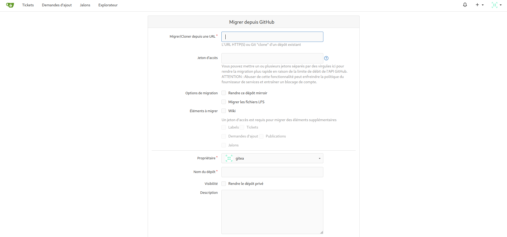

Nous pouvons également #créer# un nouveau **dépôt**. Cela se présente de la manière suivante :

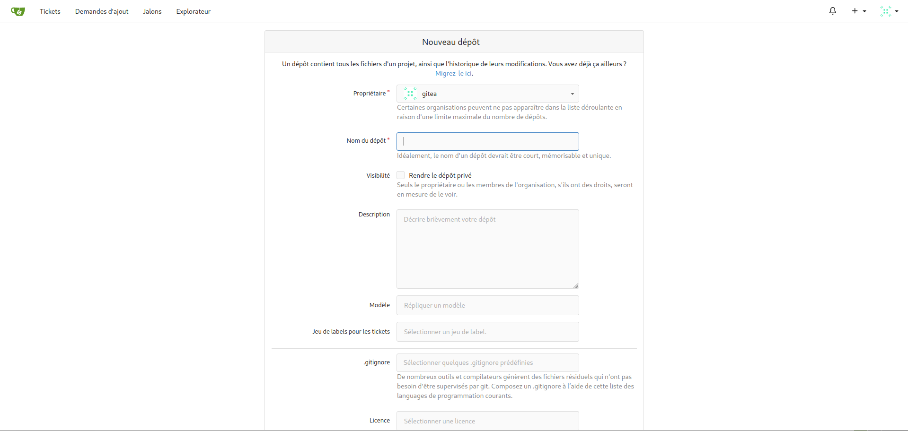

Une fois le dépôt crée, vous devriez atterir sur cette page :

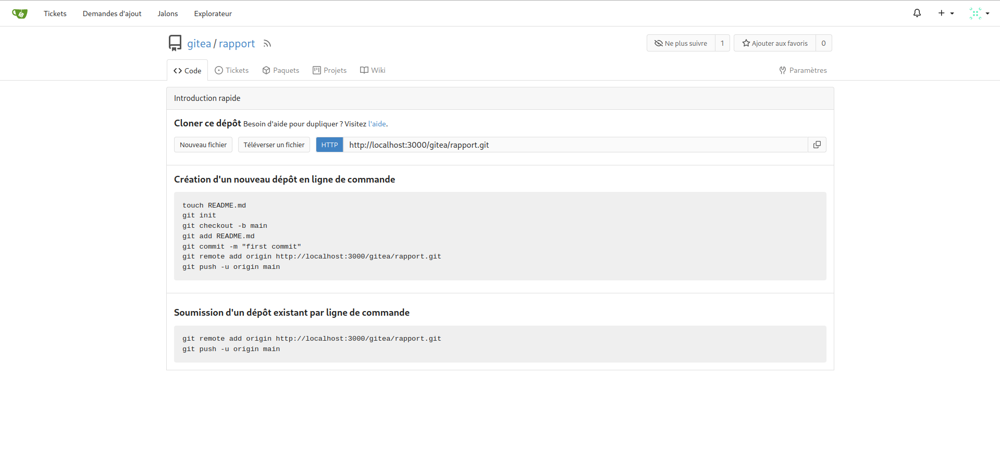

NOTE: (Cette page contient les éléments sauvegarder dans nos dépôts ainsi que la manière de cloner ce dépôt).

Nous pouvons également #créer# directement un **nouveau fichier** dans notre **dépôt** en cliquant sur le bouton #« Nouveau fichier »#, cela nous amène sur cette page :

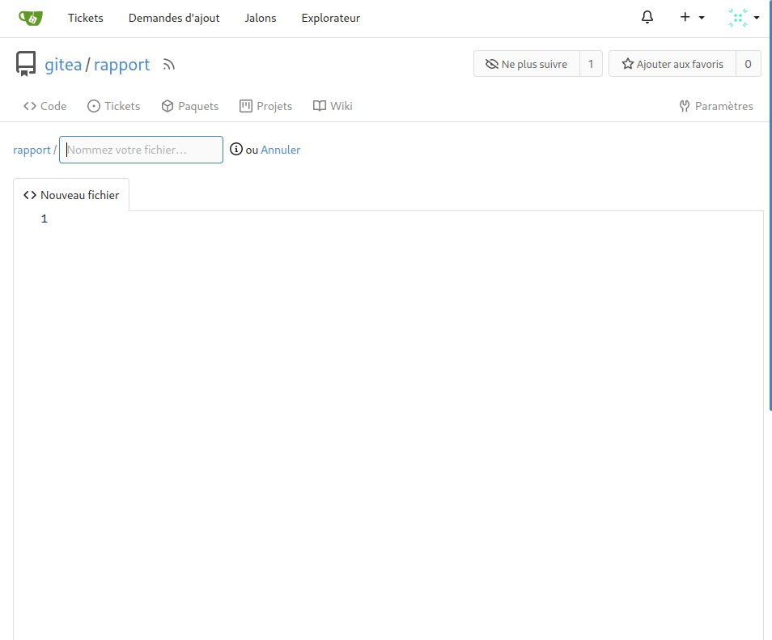

NOTE: Dans notre cas, nous avons #crée# un **fichier** nommé #« test »# comportant un texte simple afin de nous permettre de #tester# cette fonctionnalité.

Nous pouvons également #ajouter/téléverser# un **fichier** #déjà existant# à l’aide du bouton #« Téléverser fichier »#, cela nous amène sur la page suivante :

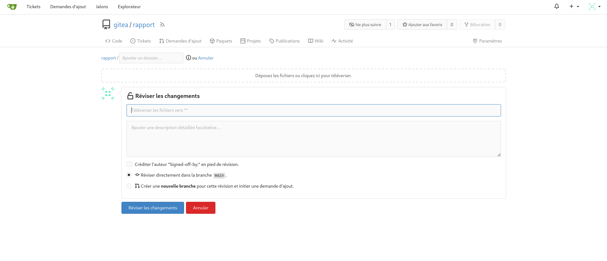

NOTE: Dans notre cas, nous avons #téléversé# notre **rapport** dans le fichier #« rapport »#, et nous l’avons intitulé #« Fantuz-Chrobot_Niel_Guislin_rapport »#.

Après avoir fait tout cela, voici le **résultat final** :

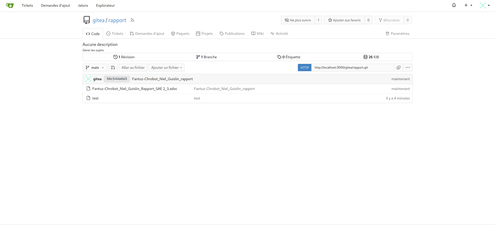

== Balisage léger avancé

[abstract]
.Mise en place d'un template personnalisé

Nous avons, pour cette dernière partie de notre projet, #amélioré# l’aspect **esthétique** de notre rapport via l’ajout d’un fichier **CSS** (CSS étant un langage informatique permettant de styliser une page Internet).

Nous avons d’abord commencé par #récupérer# le **CSS** déjà présent lors de la génération de la page **HTML** (langage de structuration d'une page Internet) de notre rapport, puis nous y avons fait quelques modifications (à l'aide de quelque commande CSS) :

|===
|Parties modifiées |modification|couleur

1.3+|Pages
2.1+| Body: nouvelle image d'arrière plan (de couleur grise).
2.1+| Bar de navigation: Bar de navigation disposée au début de la page afin d'éviter un surdosage de la page et changement de la couleur des liens de cette dernière passant de bleu à rouge lorsque la souris survole le texte. 
2.1+| Centrage des textes.
|Images | ajout d'une bordure. | Blanc
|Textes en gras|changement de la couleur des **textes en gras**. | Violet
|Textes surlignés | changement de la couleur des #textes surlignés#. | Bleu clair
|Lien| changement de la couleur des liens. | Rouge
|Sous-titres| Sous-titres disposés à gauche de la page et changement de leur couleur | Rouge clair
|Codes sources | modification couleur du texte des codes sources ainsi que leur font | font: orange clair, couleur : rouge
|Blocs de textes composés de codes sources (content) | changement de la couleur des blocs de textes composés de codes sources | orange clair
|===

Pour finir, dans cette dernière partie de notre projet, nous avons également appris à #faire# un **tableau complexe** (comme présenté ci-dessus) de la manière suivante :

.Fusion de colonnes

Pour avoir une #plage de cellules de colonnes consécutives#, il faut entrer le facteur de plage de colonne et l'opérateur de l'intervalle de la manière suivante : `<n>+` (#"<n>"# correspond au nombre de colonne dont la cellule sera composée). Cela doit être #mentionner# juste avant le début de la cellule souhaitée. **N’insérez pas d’espace** entre le #"+"#, les #opérateurs d’alignement ou de style# (en cas de présence) et le #séparateur de la cellule "|"#.

.Fusion de lignes

Pour fusionner des lignes, le processus est le même, mais avec un #"."# disposé juste avant le facteur de plage. Voici comment cela s'écrit: `.<n>+`.

.Fusion de colonnes et lignes

Une seule cellule peut couvrir un bloc de colonnes et de lignes adjacentes. Inscrire le facteur de plage de la colonne #"<n>"#, suivis du facteur d'intervalle de ligne #".<n>"#, puis l'opérateur #"+"#.

.Modification du style du PDF

Concernant le PDF, nous avons modifier les couleurs de ce dernier (pas tout à fait équivalent à celles de la page HTML histoire de faire varier les plaisirs), et nous avons également modifier l'emplacement de la bar de navigation (ainsi déplacée en haut de la page), et nous avons également centré les sous-titres de nos différentes parties.

[NOTE,role=warning]
NOTE: Il est bon de mentionner que pour modifier l'apparence d'un PDF généré avec asciidoctor, il ne faut pas utiliser un fichier CSS mais un fichier YML, en ajoutant l'extension #".yml"# au fichier comportant les modifications du style du PDF.

// Indexe uniquement pour la version pdf
ifdef::backend-pdf[]
[index]
= Index
endif::[]
